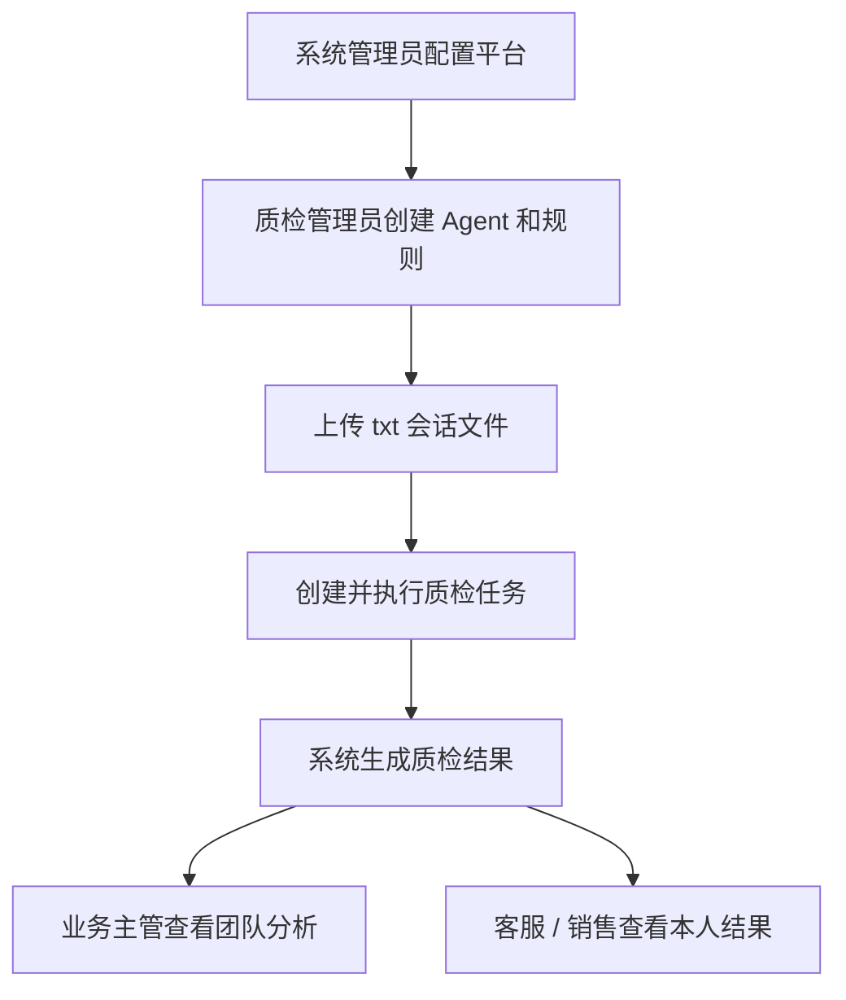
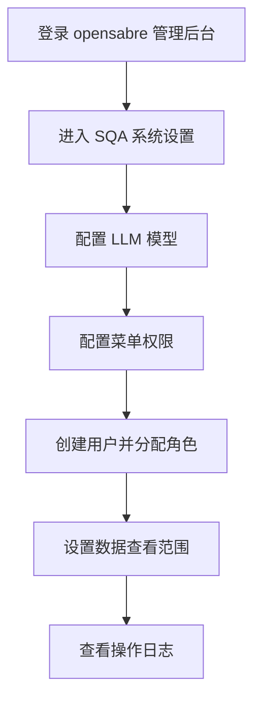
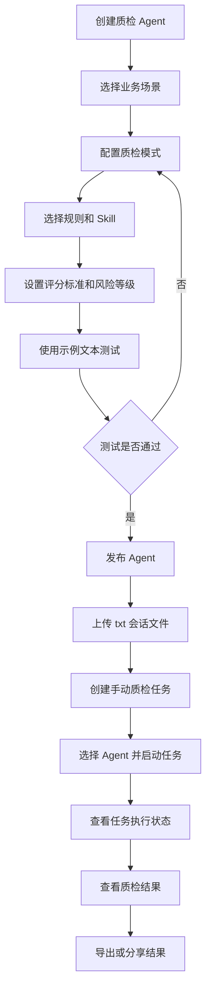
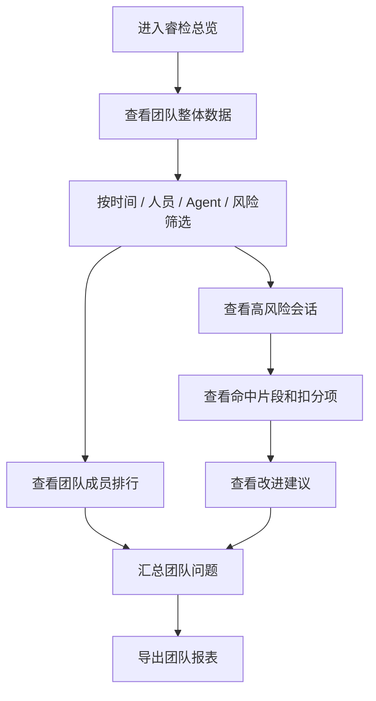
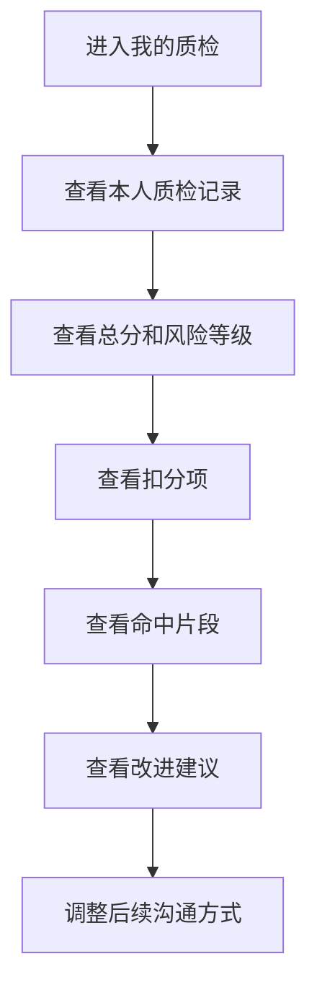
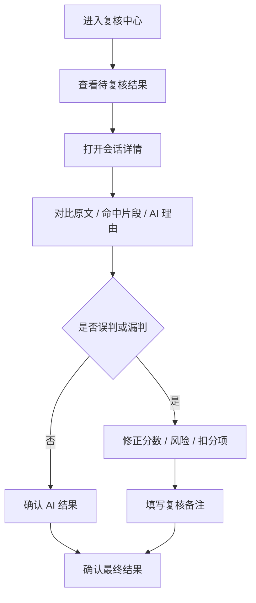
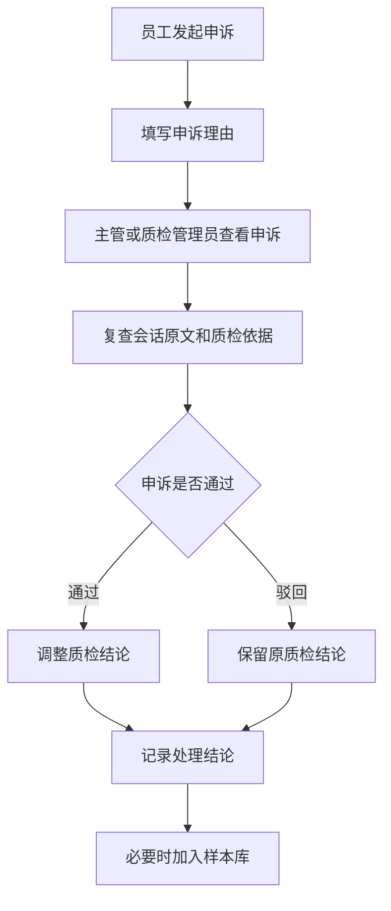

# 睿检智能质检平台 SQA 产品需求文档

## 1. 产品概述

### 1.1 产品名称

- 中文名称：睿检智能质检平台
- 产品简称：SQA
- 英文名称：Smart QA

### 1.2 产品定位

睿检智能质检平台 SQA 是面向客服与销售沟通场景的智能质检、复核与改进平台。平台通过可配置的质检 Agent，对客服、销售与客户之间的沟通记录进行自动化质检，识别违规风险、服务问题、销售风险和流程缺失，并形成可复核、可追踪、可优化的质量管理闭环。

### 1.3 建设目标

- 支持公司管理者根据业务场景创建不同的质检 Agent。
- 支持专家规则、正则规则、LLM 语义判断、Skill 专家能力等多种质检模式。
- 支持对通用沟通记录进行批量质检、评分、扣分和风险识别。
- 支持质检结果查看、解释和导出，避免 AI 结果黑盒化。
- 支持质检数据统计分析，帮助管理者发现团队问题、人员问题和业务风险。
- 支持样本沉淀和规则优化，让质检 Agent 持续迭代。

## 2. 背景与问题

客服和销售沟通中存在大量影响客户体验、成交质量和合规风险的问题，例如服务态度差、未按流程处理、违规承诺、夸大宣传、私下引流、未充分告知风险等。传统人工质检存在覆盖率低、标准不统一、反馈滞后、成本高的问题。

SQA 需要解决以下问题：

- 如何将不同业务场景的质检标准配置化。
- 如何让质检结果既有自动化效率，又有可解释性和可复核性。
- 如何让管理者快速发现高风险沟通和团队共性问题。
- 如何让客服和销售人员看到明确的扣分原因和改进建议。
- 如何持续优化规则、Prompt 和 Skill，降低误判与漏判。

## 3. 用户角色

### 3.1 一期核心角色

一期建议先保留 4 个核心角色，覆盖平台初始化、质检配置、团队查看和个人结果查看。

| 角色 | 定位 | 主要操作功能 |
| --- | --- | --- |
| 系统管理员 | 管理平台基础能力 | 用户管理、角色权限、菜单权限、模型配置、系统参数、操作日志、数据权限配置 |
| 质检管理员 | 建立质检体系并执行任务 | 创建质检 Agent、配置规则、配置评分标准、上传会话文件、发布质检任务、查看全部质检结果、管理内置模板 |
| 业务主管 | 查看团队沟通质量 | 查看团队质检看板、查看成员结果、分析问题分布、跟踪高风险会话、导出团队报表 |
| 客服 / 销售人员 | 被质检对象 | 查看自己的质检结果、扣分原因、命中片段和改进建议 |

### 3.2 后续扩展角色

以下角色不进入一期 MVP，待人工复核、申诉、多渠道接入、Skill 体系成熟后再启用。

| 角色 | 启用时机 | 主要操作功能 |
| --- | --- | --- |
| 质检员 / 复核员 | 二期人工复核上线后 | 查看待复核结果、修正分数、标记误判/漏判、补充质检备注 |
| 申诉处理人 | 二期申诉流程上线后 | 查看申诉、复查会话原文、处理申诉结论、沉淀争议样本 |
| 模板管理员 | 模板数量增加后，可由质检管理员兼任 | 维护客服解答模板、销售流程模板、规则模板、Prompt 模板、Skill 模板 |
| 数据管理员 | 多渠道接入上线后 | 管理导入记录、查看解析失败记录、维护渠道和字段映射 |
| 审计 / 合规人员 | 用于正式考核或合规留痕后 | 查看高风险会话、查看敏感操作日志、导出合规记录、追踪版本 |

### 3.3 角色权限边界

一期权限设计围绕 3 个维度展开：

- 配置权：能否创建 Agent、规则、评分标准、模板。
- 执行权：能否上传会话、创建任务、重新执行任务。
- 查看权：能看全部、部门、本人，还是只能看脱敏结果。

一期推荐权限矩阵：

| 功能 | 系统管理员 | 质检管理员 | 业务主管 | 客服 / 销售 |
| --- | --- | --- | --- | --- |
| 用户角色管理 | 是 | 否 | 否 | 否 |
| 模型配置 | 是 | 否 | 否 | 否 |
| Agent 管理 | 是 | 是 | 只读 | 否 |
| 规则管理 | 是 | 是 | 只读 | 否 |
| 上传会话文件 | 是 | 是 | 可选 | 否 |
| 创建质检任务 | 是 | 是 | 可选 | 否 |
| 查看全部结果 | 是 | 是 | 否 | 否 |
| 查看团队结果 | 是 | 是 | 是 | 否 |
| 查看本人结果 | 是 | 是 | 是 | 是 |
| 导出结果 | 是 | 是 | 是 | 否 |
| 查看操作日志 | 是 | 可选 | 否 | 否 |

## 4. 核心概念

### 4.1 质检 Agent

质检 Agent 是 SQA 的核心配置对象。每个 Agent 对应一个具体业务场景，例如售前销售质检、售后客服质检、投诉处理质检、续费回访质检等。

Agent 可以组合使用规则、LLM 和 Skill，对沟通记录进行判断、评分和输出改进建议。

### 4.2 质检规则

质检规则是可复用的检测标准。规则可以是关键词、正则表达式、结构化条件，也可以是由 LLM 执行的语义判断。

### 4.3 Skill

Skill 是封装复杂判断逻辑的专家能力。它可以承载特定行业、特定流程、特定风险类型的判断方法，例如销售违规承诺识别、投诉升级判断、服务态度评估等。

### 4.4 质检任务

质检任务用于指定质检范围、质检 Agent 和执行方式。任务可以手动执行，也可以定时执行或按抽样策略执行。

### 4.5 质检结果

质检结果是一次会话经过 Agent 检测后的输出，包括得分、命中规则、扣分明细、风险等级、证据片段、AI 判断理由和改进建议。

### 4.6 通用会话

通用会话是 SQA 一期的核心数据对象，表示一段完整的文本沟通内容。它不预设客服、销售等行业标签，先通过统一结构承载上传内容，再交由不同 Agent 做分类质检。

## 5. 质检模式

### 5.1 专家规则模式

通过关键词、正则表达式、结构化条件进行确定性检测。

适用场景：

- 禁用词检测
- 敏感词检测
- 手机号、微信号、金额、链接等格式检测
- 必说项检测
- 明确违规话术检测

特点：

- 结果稳定
- 成本低
- 可解释性强
- 对复杂语义理解能力有限

### 5.2 专家规则 + LLM 模式

先通过规则筛选或命中候选内容，再由 LLM 进行语义判断、风险解释和改进建议生成。

适用场景：

- 规则命中后需要判断上下文语义
- 需要区分真实违规与正常表达
- 需要生成自然语言解释和建议

特点：

- 兼顾确定性和语义理解
- 适合作为 MVP 主模式
- 成本和效果相对可控

### 5.3 LLM + Skill 模式

由 LLM 调用或遵循 Skill 中定义的专业判断流程，对复杂业务场景进行综合评估。

适用场景：

- 销售沟通质量综合评分
- 客服投诉处理质量判断
- 客户意向识别
- 行业合规判断
- 多轮对话流程完整度评估

特点：

- 灵活度高
- 适合复杂判断
- 需要样本测试、版本控制和人工复核保障质量

## 6. 功能清单

### 6.1 睿检总览

面向管理者展示质检整体情况。

主要功能：

- 展示总质检会话数
- 展示平均分、不合格率、高风险会话数
- 展示风险趋势
- 展示团队排行、人员排行
- 展示规则命中排行
- 展示任务状态、结果分布和风险分布

### 6.2 质检 Agent 管理

主要功能：

- 新增、编辑、停用、复制质检 Agent
- 设置 Agent 名称、场景、适用渠道、适用部门、说明
- 配置质检模式：专家规则、专家规则 + LLM、LLM + Skill
- 选择规则集和 Skill
- 配置评分标准和风险等级
- 支持 Agent 版本管理
- 支持发布、停用、回滚和试运行

### 6.3 质检规则管理

主要功能：

- 新增、编辑、停用、复制规则
- 按规则分类管理
- 支持关键词、正则、结构化条件、LLM 判断规则
- 设置检测对象：客服、销售、客户、双方全部
- 设置扣分、风险等级、一票否决
- 设置命中示例和误判示例
- 支持规则版本管理
- 支持规则测试

规则分类建议：

- 禁用词规则
- 必说项规则
- 流程规则
- 服务态度规则
- 销售合规规则
- 风险承诺规则
- 私下引流规则
- 隐私泄露规则
- 自定义正则规则

### 6.4 Skill 管理

主要功能：

- 新增、编辑、停用 Skill
- 设置 Skill 名称、说明、适用场景
- 设置输入格式、输出格式和判断步骤
- 设置 Prompt 或专业判断说明
- 配置评分维度
- 配置示例样本
- 支持 Skill 测试
- 支持 Skill 版本管理
- 查看 Skill 被哪些 Agent 引用

### 6.5 沟通记录管理

主要功能：

- 上传文本沟通记录用于模拟质检
- 支持按时间、渠道、人员、部门、客户、业务标签查询
- 支持查看会话详情
- 支持对会话内容进行说话人区分
- 支持关联客户、线索、订单、工单等业务对象

一期仅支持 `txt` 文件上传和解析。语音转写、图片识别、附件识别、数据库同步、API 接入放到后续迭代。

#### 一期 txt 会话格式

一期上传的 `txt` 文件采用逐行会话格式，每行表示一条消息：

```text
<序号>(<说话人角色>):[<相对时间>] <消息内容>
```

示例：

```text
0(agent):[00:00:01]您好，我是宁波银行催收专员
1(user):[00:00:03]你们现在有什么优惠吗
2(agent):[00:00:06]可以申请减免，今天处理更方便
3(user):[00:00:12]那我再看看
4(agent):[00:00:16]请您今天完成还款
```

解析后，每条消息至少保留以下字段：

| 字段 | 说明 |
| --- | --- |
| 序号 | 消息在当前会话中的顺序编号 |
| 说话人角色 | `agent` 表示客服、销售或催收人员，`user` 表示客户 |
| 相对时间 | 消息相对于会话开始的时间，格式为 `HH:mm:ss` |
| 消息正文 | 去除格式标记后的实际沟通内容 |
| 原始文本 | 保留该消息的原始行内容，便于追溯和解析异常排查 |

其中，`agent` 的具体业务身份由会话元数据或质检任务场景补充，例如客服、销售人员或催收专员；`user` 表示客户。解析器应校验序号、角色、时间和正文格式，并对无法解析的行记录错误信息。

### 6.6 质检任务管理

主要功能：

- 新建手动质检任务
- 选择质检 Agent
- 设置质检范围：时间、部门、人员、渠道、业务标签
- 设置抽样比例
- 查看任务状态和执行进度
- 支持暂停、取消、重试
- 查看任务统计：会话数、成功数、失败数、耗时

任务类型规划：

- 手动任务
- 定时任务
- 抽样任务
- 全量任务
- 事件触发任务

### 6.7 质检结果中心

主要功能：

- 查看质检结果列表
- 按 Agent、任务、人员、部门、风险等级、分数、复核状态筛选
- 查看会话原文
- 高亮命中的证据片段
- 查看扣分明细
- 查看 AI 判断理由
- 查看改进建议
- 标记误判、漏判
- 导出质检结果

结果字段建议：

- 会话信息
- 员工信息
- 客户信息
- 质检 Agent
- 总分
- 风险等级
- 命中规则
- 扣分明细
- 证据片段
- AI 判断理由
- 改进建议
- 任务状态
- 生成时间

### 6.8 复核中心

主要功能：

- 该能力一期不做，后续版本再补充

### 6.9 申诉管理

主要功能：

- 该能力一期不做，后续版本再补充

### 6.10 样本库

主要功能：

- 将质检结果加入样本库
- 标记正例、反例、误判、漏判
- 维护标准答案
- 按场景、规则、Agent、风险类型管理样本
- 使用样本测试 Agent 效果
- 对比不同版本 Agent 的效果

### 6.11 质检报表

主要功能：

- 按时间统计质检趋势
- 按部门统计质检结果
- 按人员统计质检结果
- 按规则统计命中情况
- 按风险等级统计风险分布
- 分析高频问题
- 分析复核修正率
- 分析申诉通过率
- 分析 AI 误判率和漏判率

### 6.12 系统配置

主要功能：

- 配置 LLM 模型供应商
- 配置模型参数
- 配置数据脱敏规则
- 配置质检默认评分标准
- 配置任务并发和失败重试策略
- 配置权限和数据范围
- 查看审计日志

## 7. 菜单规划

### 7.1 一期 MVP 菜单

一期菜单需要覆盖从会话上传、Agent 配置、任务执行到结果查看的最小闭环。

```text
睿检智能质检 SQA
├── 睿检总览
│
├── 会话中心
│   ├── 会话列表
│   └── 上传会话
│
├── 质检任务
│   ├── 任务列表
│   └── 新建任务
│
├── 质检结果
│   ├── 结果列表
│   ├── 高风险会话
│   └── 我的质检
│
├── Agent 工坊
│   ├── Agent 列表
│   └── Agent 测试
│
├── 规则中心
│   ├── 规则列表
│   └── 评分标准
│
├── 模板中心
│   ├── 客服解答模板
│   └── 销售流程模板
│
└── 系统设置
    ├── 模型配置
    └── 操作日志
```

### 7.2 后续预留菜单

```text
样本库
├── 样本列表
├── 误判样本
├── 漏判样本
└── 标准答案

报表分析
├── 团队质检报表
├── 人员质检报表
├── 规则命中报表
└── Agent 效果报表

复核中心
├── 待复核结果
├── 高风险复核
└── 复核记录

申诉管理
├── 申诉列表
└── 申诉处理记录
```

### 7.3 按角色可见菜单

| 菜单 | 系统管理员 | 质检管理员 | 业务主管 | 客服 / 销售 |
| --- | --- | --- | --- | --- |
| 睿检总览 | 是 | 是 | 是 | 否 |
| 会话中心 | 是 | 是 | 可选 | 否 |
| 质检任务 | 是 | 是 | 可选 | 否 |
| 质检结果 | 是 | 是 | 是 | 部分 |
| 我的质检 | 是 | 是 | 是 | 是 |
| Agent 工坊 | 是 | 是 | 只读 | 否 |
| 规则中心 | 是 | 是 | 只读 | 否 |
| 模板中心 | 是 | 是 | 只读 | 否 |
| 系统设置 | 是 | 部分 | 否 | 否 |
| 样本库 | 后续 | 后续 | 后续 | 否 |
| 报表分析 | 后续 | 后续 | 后续 | 否 |

## 8. 核心业务流程

### 8.1 一期主流程

```text
系统管理员配置平台
        ↓
质检管理员创建 Agent 和规则
        ↓
质检管理员上传 txt 会话文件
        ↓
质检管理员创建并执行质检任务
        ↓
系统生成质检结果
        ↓
业务主管查看团队分析
        ↓
客服 / 销售查看本人改进建议
```



### 8.2 系统管理员工作流

1. 登录 opensabre 管理后台。
2. 进入 SQA 系统设置。
3. 配置 LLM 模型供应商、模型参数和调用密钥。
4. 配置基础菜单权限。
5. 创建或分配用户角色。
6. 设置数据查看范围，例如全部数据、部门数据、本人数据。
7. 查看操作日志，确认关键操作可追溯。



### 8.3 质检管理员工作流

1. 质检管理员创建 Agent。
2. 选择业务场景和适用范围。
3. 配置质检模式。
4. 选择规则和 Skill。
5. 设置评分标准和风险等级。
6. 使用示例文本测试 Agent 效果。
7. 发布 Agent。
8. 上传 `txt` 会话文件。
9. 创建手动质检任务。
10. 选择要使用的 Agent。
11. 启动质检任务。
12. 查看任务执行状态。
13. 查看质检结果、命中规则、扣分原因、AI 判断理由。
14. 导出质检结果或分享给业务主管。



### 8.4 业务主管工作流

1. 登录 SQA。
2. 进入睿检总览。
3. 查看团队整体质检数据，例如平均分、不合格率、高风险数量。
4. 按时间、人员、Agent、风险等级筛选结果。
5. 查看团队成员排行。
6. 进入高风险会话详情。
7. 查看命中片段、扣分项和改进建议。
8. 汇总常见问题，例如话术不完整、服务态度差、销售流程缺失。
9. 导出团队报表。



### 8.5 客服 / 销售人员工作流

1. 登录 SQA。
2. 进入我的质检。
3. 查看自己的会话质检记录。
4. 查看每条记录的总分和风险等级。
5. 查看扣分项。
6. 查看命中片段。
7. 查看 AI 给出的改进建议。
8. 根据建议调整后续沟通方式。



### 8.6 后续复核工作流

1. 复核员进入复核中心。
2. 查看待复核结果。
3. 打开会话详情。
4. 对比原文、命中片段和 AI 判断理由。
5. 判断 AI 是否误判或漏判。
6. 修正分数、风险等级或扣分项。
7. 填写复核备注。
8. 确认最终结果。



### 8.7 后续申诉工作流

1. 客服或销售人员对某条质检结果发起申诉。
2. 填写申诉理由。
3. 主管或质检管理员查看申诉。
4. 重新查看会话原文和质检依据。
5. 决定申诉通过或驳回。
6. 系统记录最终结论。
7. 必要时把样本加入误判或漏判样本库。



## 9. MVP 范围建议

第一阶段建议优先建设以下能力：

- 通用会话质检框架
- 质检 Agent 管理
- 质检规则管理
- 专家规则 + LLM 模式
- 文本沟通记录管理
- `txt` 文件上传和解析
- 手动质检任务
- 质检结果中心
- 基础统计总览

第一阶段暂不重点建设：

- 可视化编排
- 语音转写质检
- 图片和附件识别
- 数据库同步
- API 接入
- 自动规则推荐
- 多 Agent 协作
- 复杂工作流编排
- 行业模板市场
- 人工复核
- 申诉管理
- 多租户隔离
- Token 成本统计
- 模型调用成本统计

## 10. 迭代规划

### 10.1 一期：可用的智能质检闭环

目标：完成通用会话质检框架、Agent 配置、任务执行和结果查看的最小闭环。

范围：

- 通用会话抽象
- Agent 管理
- 规则管理
- LLM 辅助判断
- 手动任务
- `txt` 上传和解析
- 结果查看
- 基础统计

### 10.2 二期：可运营的质检体系

目标：让质检平台支持稳定运营、效果优化和管理分析。

范围：

- Skill 管理
- Agent 版本管理
- 定时任务
- 抽样任务
- 样本库
- 质检报表
- Agent 效果评估
- 人工复核
- 申诉管理

### 10.3 三期：智能化与多渠道扩展

目标：扩展更多数据源和智能能力。

范围：

- 多渠道自动接入
- 语音转写质检
- 图片和附件识别
- 自动规则推荐
- 行业质检模板
- 更复杂的 Agent 编排

## 11. 权限与审计

### 11.1 权限要求

- Agent 查看、创建、编辑、发布、停用权限
- 规则查看、创建、编辑、发布、停用权限
- Skill 查看、创建、编辑、发布、停用权限
- 任务创建、执行、取消、重试权限
- 结果查看权限
- 数据导出权限
- 模型配置权限

### 11.2 数据范围

质检结果和沟通记录应按组织、部门、人员进行数据范围控制。一期不做多租户隔离。

建议支持：

- 仅本人
- 本部门
- 本部门及下级部门
- 全部数据
- 自定义数据范围

### 11.3 审计日志

需要记录以下操作：

- 创建、修改、发布 Agent
- 创建、修改、发布规则
- 创建、修改、发布 Skill
- 创建、执行、取消任务
- 查看敏感沟通记录
- 修改质检结果
- 导出数据
- 修改模型配置

## 12. 非功能需求

### 12.1 可解释性

质检结果必须包含命中依据、证据片段、扣分原因和 AI 判断理由，避免只输出结论。

### 12.2 可复核性

一期 AI 结果直接作为质检结论输出，后续版本再补充人工复核链路。

### 12.3 可追溯性

质检结果应记录使用的 Agent 版本、规则版本、Skill 版本和模型配置，便于后续追溯。

### 12.4 安全性

沟通记录中可能包含客户隐私和商业信息，需要支持权限控制、脱敏、访问审计和导出控制。

### 12.5 可扩展性

平台应支持后续扩展更多渠道、更多模型、更多 Skill 和更多行业模板。

## 13. 已确认范围

1. MVP 首先做通用会话质检框架。
2. 一期用户通过上传 `txt` 文件模拟沟通记录。
3. 一期不做可视化编排。
4. LLM 输出不强制经过人工复核。
5. 一期不做人工审核和申诉链路。
6. 一期不做多租户隔离。
7. 一、二期暂不统计 Token 成本和模型调用成本。
8. 第一批内置模板先覆盖客服解答用户问题、销售人员销售流程等通用场景。

## 14. 待讨论问题

1. 通用会话的标准字段是否需要先固定为最小结构，比如标题、来源、参与方、正文、标签、时间？
2. `txt` 文件的内容格式是否需要约定模板，还是完全按自由文本解析？
3. 质检结果的展示粒度要到什么程度，是否需要逐条命中片段高亮？
4. 第一版评分规则是否采用统一分值，还是允许每个 Agent 自定义权重？
5. 第一批内置模板中，客服解答用户问题和销售流程各自需要哪些必检项？
