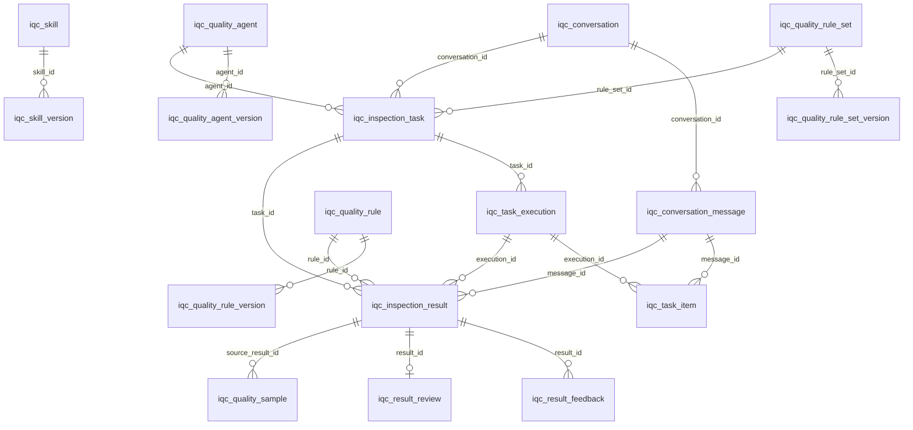

# 数据模型与 ER 图

本文档对应当前完整建库脚本 [`iqc-platform-ddl.sql`](../src/main/resources/db/iqc-platform-ddl.sql)。当前采用应用层逻辑外键，DDL 未声明物理外键。

| 领域 | 表 | 说明 |
| --- | --- | --- |
| 会话 | `iqc_conversation`、`iqc_conversation_message` | 导入/API 会话及有序消息 |
| Agent 与能力 | `iqc_quality_agent`、`iqc_quality_agent_version`、`iqc_skill`、`iqc_skill_version`、`iqc_mcp_server`、`iqc_model_profile` | 质检 Agent、技能、MCP 与模型配置 |
| 规则 | `iqc_quality_rule`、`iqc_quality_rule_version`、`iqc_quality_rule_set`、`iqc_quality_rule_set_version` | 规则和规则集的当前态及版本快照 |
| 执行 | `iqc_inspection_task`、`iqc_task_execution`、`iqc_task_item` | 任务、重试执行和消息级工作项 |
| 结果闭环 | `iqc_inspection_result`、`iqc_result_feedback`、`iqc_result_review`、`iqc_quality_sample` | 命中结果、反馈、复核和样本沉淀 |

`rule_ids_json`、任务快照等 JSON 字段用于保证执行可重现，不等同于实时外键。`owner_group_id` 是来自组织服务的数据范围快照。数据库演进以 Flyway 目录为准。
