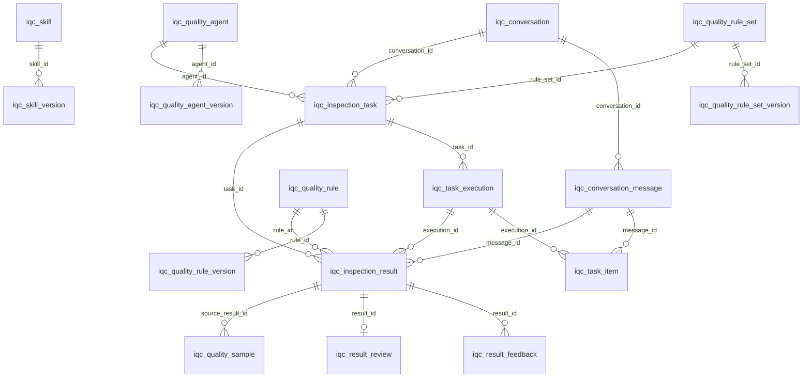

# 数据模型与 ER 图

本文档对应 [`db/migration/mysql/`](../src/main/resources/db/migration/mysql/) 中的 Flyway 基线与后续迁移。业务聚合之间主要采用应用层逻辑外键；规范化质检结果内部使用物理外键保证会话结果、规则结果和证据的一致性。

## 业务方案及派生来源

`iqc_inspection_scheme` 是可编辑草稿与当前发布指针；`iqc_inspection_scheme_version` 追加保存不可变发布快照。`V1.1.31` 在方案主记录保存可空的直接来源方案 ID、冻结名称/编码、来源版本号和内容摘要。创建派生草稿时，服务端按来源 ID 与版本读取并校验已发布快照，再复制冻结业务定义；不会从浏览器接受来源配置，也不会跟随来源方案后续编辑。来源字段只在创建时写入，目标草稿后续修订不改变来源链。来源关系没有物理外键，需与任务快照一样按应用层授权和版本摘要校验。

`V1.1.32` 在发布版本行新增 `archived` 标记，默认 `FALSE`。只允许改变低于方案当前发布指针的版本；归档不改写快照、不改变当前指针。专家仍可读取归档快照并恢复；普通模板历史不返回归档版本，新建任务和派生草稿拒绝使用它。已经创建的任务以自身冻结快照继续处理，不重新读取发布版本的归档状态。

## 标签洞察领域

标签采用固定三级结构：`iqc_label_category`（分类）→ `iqc_label_group`（标签组）→ `iqc_label`（业务标签）。标签本身不保存检测表达式，而是通过 `iqc_label_rule_binding` 绑定既有已发布规则；结构化值由 `iqc_label_value_definition` 定义。`iqc_label_collection` 与成员表用于复用业务选择范围，任务创建时会展开并固化为标签、值、规则及版本快照。

检测仍以 `iqc_inspection_conversation_result`、`iqc_inspection_rule_result` 和 `iqc_inspection_evidence` 为规范结果。`iqc_inspection_label_result` 只是从规范规则结果投影出的业务洞察，保留标签版本、来源规则结果、置信度和值。AI 自动扩展写入隔离的 `iqc_label_candidate`；人工批准只创建标签草稿，不能直接进入发布树。

联合标签会将逐消息事实、候选来源和原文引文写入现有结果列。`V1.1.29` 将 `iqc_inspection_result.finding_json`、`evidence_json` 和 `iqc_inspection_label_result.value_json` 从 `TEXT` 扩为 `MEDIUMTEXT`；不新增结果表或改变旧行语义。迁移必须在运行新版联合试跑代码前完成，仍需隔离 MySQL 验证新库、升级与重复迁移路径；`MEDIUMTEXT` 不是无限容量，超长模型输出仍需运行链路上限验收。

```mermaid
erDiagram
    iqc_conversation ||--o{ iqc_conversation_message : conversation_id
    iqc_conversation ||--o{ iqc_inspection_task : conversation_id
    iqc_quality_agent ||--o{ iqc_quality_agent_version : agent_id
    iqc_quality_agent ||--o{ iqc_inspection_task : agent_id
    iqc_skill ||--o{ iqc_skill_version : skill_id
    iqc_quality_rule ||--o{ iqc_quality_rule_version : rule_id
    iqc_quality_rule_set ||--o{ iqc_quality_rule_set_version : rule_set_id
    iqc_quality_rule_set ||--o{ iqc_inspection_task : rule_set_id
    iqc_inspection_task ||--o{ iqc_task_execution : task_id
    iqc_task_execution ||--o{ iqc_task_item : execution_id
    iqc_conversation_message ||--o{ iqc_task_item : message_id
    iqc_inspection_task ||--o{ iqc_inspection_result : task_id
    iqc_task_execution ||--o{ iqc_inspection_result : execution_id
    iqc_conversation_message ||--o{ iqc_inspection_result : message_id
    iqc_quality_rule ||--o{ iqc_inspection_result : rule_id
    iqc_inspection_result ||--o{ iqc_result_feedback : result_id
    iqc_inspection_result ||--o| iqc_result_review : result_id
    iqc_inspection_result ||--o{ iqc_quality_sample : source_result_id
```

| 领域 | 表 | 说明 |
| --- | --- | --- |
| 会话 | `iqc_conversation`、`iqc_conversation_message` | 导入/API 会话及有序消息 |
| Agent 与能力 | `iqc_quality_agent`、`iqc_quality_agent_version`、`iqc_skill`、`iqc_skill_version`、`iqc_mcp_server`、`iqc_model_profile` | 质检 Agent、技能、MCP 与模型配置 |
| 规则 | `iqc_quality_rule`、`iqc_quality_rule_version`、`iqc_quality_rule_set`、`iqc_quality_rule_set_version` | 规则和规则集的当前态及版本快照 |
| 执行 | `iqc_inspection_task`、`iqc_task_execution`、`iqc_task_item` | 任务、重试执行和消息级工作项 |
| 结果闭环 | `iqc_inspection_result`、`iqc_result_feedback`、`iqc_result_review`、`iqc_quality_sample` | 命中结果、反馈、复核和样本沉淀 |

`rule_ids_json`、任务快照等 JSON 字段用于保证执行可重现，不等同于实时外键。`owner_group_id` 是来自组织服务的数据范围快照。数据库演进以 Flyway 目录为准。
